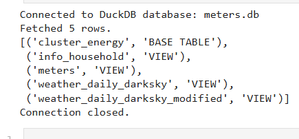

# Data Files     
in data folder            

# Analysis Notebooks           

* Extensively using **DuckDB** for analysis and data prep   
* Created the following 
       
* Starts with the name `analysis`             
* analysis_create_views - Creates the Views           
  
# Prep Data for Modelling         
         
* Starts with the name `prep_data`  

# Modelling       

* kmeans         
* lightgbm          